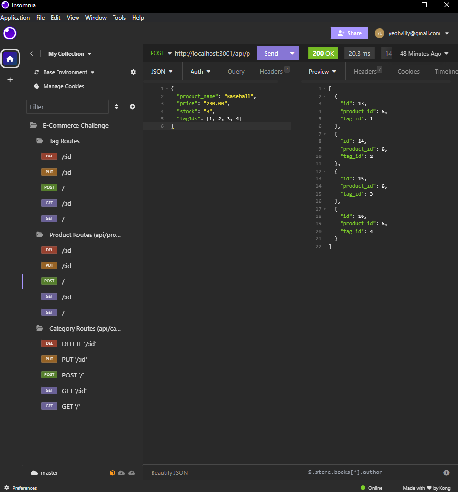

# About
This is Module 13 Challenge by the Ohio State University bootcamp. This project is showing user how to create a database and then accessing the information to and fro, through sequelize and express.

## Description
The user can create the database by running the sql file and then populate the database with 'node seeds/index'. Then, the user can start the server with 'npm server', and access the information through the various server endpoints with insomnia (or browser). This will allow the user to store his data to the database instead of local storage, making it a more viable storage option.

## Image of the 'logo.svg' file

## Link to the walkthrough video
Video URL: https://watch.screencastify.com/v/h5Gnt5cqp1m7tXYV7i96